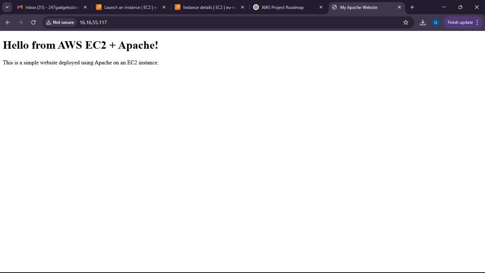

# Project 01: Deploy a Website Using EC2 + Apache

## Overview
In this project, I launch an EC2 instance, install Apache HTTP Server, and host a simple website (HTML page). This project demonstrates basic EC2 setup, web server deployment, and Security Group configuration.

## 🛠️ AWS Services Used
- EC2
- Elastic IP
- Security Groups

## Website Preview


## Steps to Reproduce

1. **Launch an EC2 Instance**
   - AMI: Ubuntu Server 20.04 (Free Tier eligible)
   - Instance Type: t2.micro
   - Key Pair: Create or use existing
   - Security Group:
     - Allow HTTP (port 80)
     - Allow SSH (port 22)
   - Launch the instance

2. **Connect to EC2 via SSH**
   ```bash
   ssh -i your-key.pem ubuntu@your-ec2-public-ip

